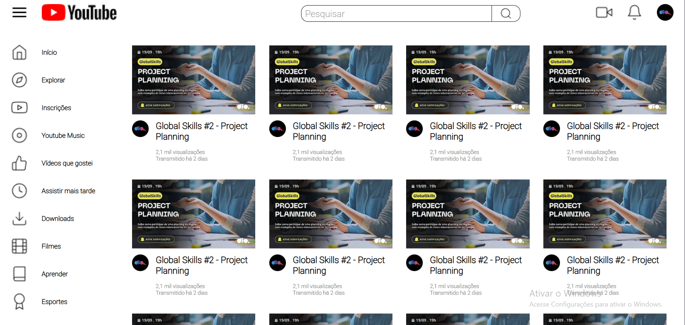

# 📺 Clone do YouTube – Projeto DIO  

  
  
  
  

Este projeto é um **clone simplificado da interface do YouTube**, desenvolvido durante o curso da [DIO](https://www.dio.me).  
O objetivo foi praticar **HTML5** e **CSS3**, com foco na utilização do **CSS Grid Layout** para estruturar a interface.  

---

## 🚀 Tecnologias Utilizadas  
- **HTML5** – Estrutura semântica do conteúdo  
- **CSS3** – Estilização da interface  
- **CSS Grid** – Organização e alinhamento dos elementos na tela  

---

## 📌 Estrutura do Layout  
O projeto foi dividido em três partes principais:  
1. **Header** – Contém a logo, barra de pesquisa e ícones de ações.  
2. **Sidebar** – Menu lateral com links de navegação.  
3. **Área Principal** – Exibição dos vídeos em **grid**, simulando a página inicial do YouTube.  

---

## 🖼 Prévia do Projeto  
<div align="center">  
    
</div>  

---

## 📂 Estrutura de Pastas  
```plaintext
📦 Clone-YT-Grid
 ┣ 📂 assets       # Imagens e ícones utilizados no projeto
 ┣ 📂 css          # Arquivos de estilo
 ┣ 📜 index.html   # Página principal
 ┗ 📜 README.md    # Documentação do projeto
```
--- 

## 📚 Aprendizados

Durante o desenvolvimento, foram reforçados conceitos como:

- Estruturação semântica em HTML

- Criação de layouts utilizando CSS Grid (grid-template-areas, grid-template-columns, gap, etc.)

- Combinação de Grid + elementos fixos (header e sidebar)

- Organização de conteúdo em cards

---

## 🏆 Créditos

Projeto desenvolvido como parte do curso **"Recriando a Interface do YouTube com CSS Grid"** da Digital Innovation One
